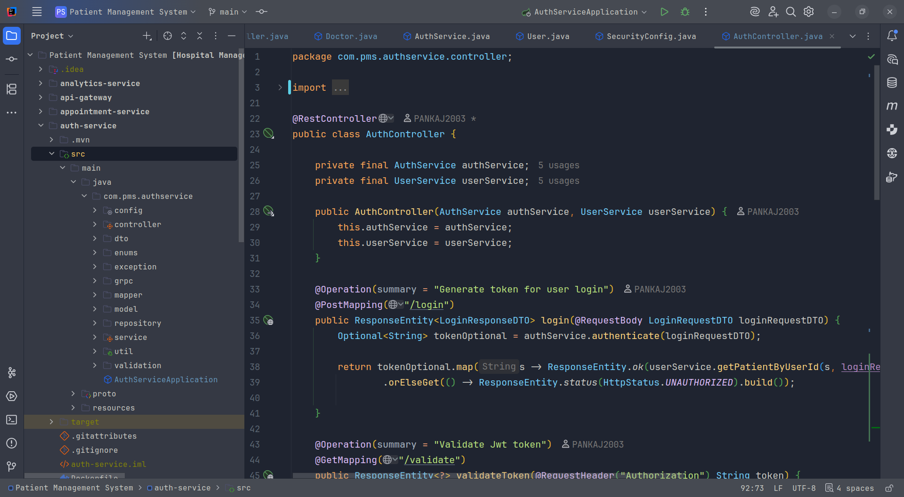
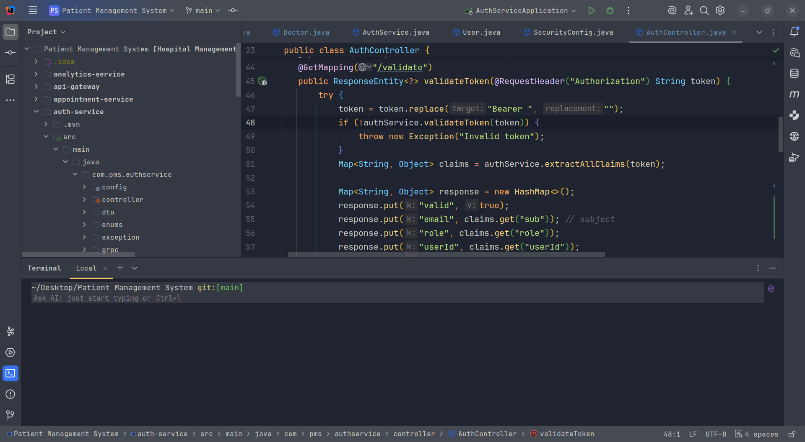

# Ayu Mirage Theme for IntelliJ IDEA

A modern, aesthetic port of the **Ayu Mirage** color scheme for JetBrains IDEs (IntelliJ IDEA, WebStorm, PyCharm, etc.). This theme provides a comfortable, low-contrast interface with vibrant syntax highlighting, designed for long coding sessions.

## 🎨 Preview

<!-- You should upload a screenshot of your IDE to your repo and link it here -->

## ✨ Features

- **True Mirage Background:** Uses the authentic `#1f2430` background color.
- **Vibrant Syntax:** Accurate syntax highlighting matching the original Ayu specification.
- **Consistent UI:** Custom colors for the Sidebar, Tab Bar, Status Bar, and popups to ensure a seamless experience.
- **Java & Kotlin Optimized:** Specific overrides for Java/Kotlin keywords, annotations, and methods.

## 📦 Installation

### Method 1: Install from Disk (Development)
1. Download the `ayu-mirage.theme.json` and `ayu-mirage.xml` files.
2. Ensure they are in the correct folder structure (JSON pointing to the XML path).
3. Zip the files into a `.jar` or `.zip` archive (optional, but recommended for plugins).
4. Open IntelliJ IDEA.
5. Go to **Settings/Preferences** > **Plugins**.
6. Click the ⚙️ (Gear icon) > **Install Plugin from Disk...**
7. Select your JSON file (or the compressed archive).
8. Restart the IDE.

### Method 2: JetBrains Marketplace
You can download plugin from Jetbrains Marketplace by searching `Ayu Mirage Dark`

## 👤 Author
**Pankaj Mishra**

---
*Based on the original Ayu colors.*
